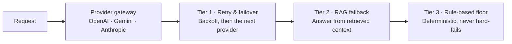

<h1 align="center">Jawad Ul Hadi</h1>

  <strong>Backend Lead / Architect · AI-first systems design</strong> 
  Islamabad · Open to relocation

  <a href="https://juh-bukhari.vercel.app">Portfolio</a> ·
  <a href="https://juh-bukhari.vercel.app/case-study">Case study</a> ·
  <a href="https://juh-bukhari.vercel.app/resume.pdf">Résumé</a> ·
  <a href="https://github.com/Qeloma">Qeloma</a> ·
  <a href="https://gravatar.com/juhbukhari">Contact</a>

---

Seven years building multi-tenant SaaS backends in **NestJS, TypeScript and PostgreSQL**. I design AI features to fail predictably: a three-tier fallback of retry, retrieval and a rule-based floor keeps them working through provider outages.

| 7+ | 12s → 2s | 0 | 99.9% |
| :---: | :---: | :---: | :---: |
| years on production backends | dashboard response time, an 83% cut | user-facing AI failures during LLM outages | uptime through live multi-tenant migrations |

## 01 · Selected work

> Client systems are under NDA. Architecture is described without business data or endpoints.

### Featured · Designing for AI failure

One abstraction sits in front of OpenAI, Gemini and Anthropic. When a provider degrades, requests step down through three tiers instead of surfacing an error. It became the team's standard failure-handling architecture and cut AI integration complexity by 60%.

[Read the full case study →](https://juh-bukhari.vercel.app/case-study)

| Role | System | Stack |
| --- | --- | --- |
| Backend Lead & Architect | Multi-tenant AI recruitment ATS | NestJS · MongoDB · Gemini · MeiliSearch · BullMQ · Postal SMTP |
| Backend Engineer | APAC HRMS & payroll core | NestJS · MySQL · PostgreSQL · GCS |
| Backend Engineer | Enterprise agile collaboration suite | NestJS · GraphQL · WebSocket · PostgreSQL · Docker |
| Software Engineer | Serverless gateway & CRM layer | AWS Lambda · API Gateway · FastAPI · Django REST |

## 02 · Projects & open source

Personal builds, public and verifiable.

**Flagship · Chrome extension pack** — Ten Manifest V3 extensions for developer and AI workflows: context extraction for agents, an API interceptor and mock sandbox, a schema and JWT decoder, a prompt workbench with diffing, token and cost estimates, a document scraper, a cross-LLM model switcher, a webhook relay, session isolation and a browser workflow recorder.
`Chrome Extension API · TypeScript · Gemini API · WebSockets · IndexedDB`

**Infrastructure · Idempotent queue spine** — A BullMQ and Redis backbone for OCR extraction, batch email and multi-tenant webhook dispatch, with HMAC signature verification, dead-letter queues and exactly-once processing.
`BullMQ · Redis · NestJS · HMAC`

### The Qeloma suite

| Project | What it does | Link |
| --- | --- | --- |
| Verdict | Tamper-evident decision engine that issues reasoning receipts with cryptographic audit trails, built for EU AI Act record-keeping. | [Source ↗](https://github.com/Qeloma/qeloma-verdict) |
| OCR | Client-side OCR with per-word confidence scores from Tesseract.js, Gemini vision or a hybrid of both. | [Source ↗](https://github.com/Qeloma/qeloma-ocr) |
| Lens Studio | Summarise, extract and compare across PDFs, DOCX and images, powered by Gemini with rule-based fallbacks. | [Live ↗](https://qelomalens.vercel.app/) |
| Voice Studio | Real-time voice analyst that answers from your own documents through the Gemini Live API. | [Live ↗](https://qeloma-voice.vercel.app/) |
| Shift | Semantic diffing for contracts and configs that ranks changes by severity and explains business impact. | [Live ↗](https://qeloma-shift.vercel.app/) |
| Cover Studio | Browser-based LinkedIn banner studio that composes on-brand vector cover art from a short prompt. | [Source ↗](https://github.com/Qeloma/qeloma-cover-studio) |
| Room Booking Engine | Scheduling backplane that resolves overlapping booking requests with conflict-safe reservation locking. | [Source ↗](https://github.com/Qeloma/qeloma_room_booking_app) |

### Contribution activity

Charts are generated from real public GitHub data. Nothing is backfilled.

  

  
  

## 03 · Stack & credentials

| Area | Tools |
| --- | --- |
| Architecture | Multi-tenant SaaS, microservices, event-driven design, GraphQL API design, reliability trade-offs |
| Backend | Node.js, NestJS, TypeScript, Python, FastAPI, PostgreSQL, MongoDB, MySQL, Redis |
| AI systems | RAG pipelines, MCP servers, OpenAI, Gemini and Anthropic integration, Claude Code, Copilot |
| Delivery | GitHub Actions, Jest, OAuth 2.0 / JWT, AWS, GCP, Docker, Kubernetes |

**Education** — B.S. Computer Science, Government College University, Faisalabad, 2018

**Certifications** — 53 verified certifications across Anthropic, IBM, Microsoft, Google and LinkedIn Learning. Each links to the issuer's verification page: [CERTIFICATIONS.md](./CERTIFICATIONS.md)

## 04 · Services & contact

| | Service | Scope |
| --- | --- | --- |
| 01 | Backend architecture | Multi-tenant SaaS design with tenant isolation, schema strategy and REST or GraphQL API contracts. |
| 02 | AI platform & resilience | Provider-agnostic LLM layers, RAG pipelines and fallback ladders that keep AI features up through outages. |
| 03 | Performance & scale | Query and index work, search, and queue-based workloads that keep APIs sub-second under load. |
| 04 | Technical leadership | Leading backend teams through design review, code review and mentoring. |

**Let's build something resilient together.** Open to Backend Lead, Solutions Architecture and AI Platform roles, remote, hybrid or relocating.

[Contact me on Gravatar ↗](https://gravatar.com/juhbukhari) · [Portfolio ↗](https://juh-bukhari.vercel.app)

---

<em>“The best code is never rewritten, because it is flexible enough to evolve with the business.”</em>

